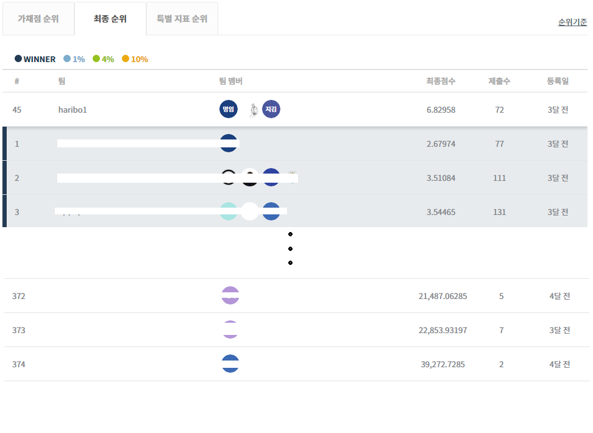

<h1>Temperature Estimation AI Competition by Public Data Analysis 
(공공 데이터 활용 온도 추정 AI 경진대회)</h1>

# # Introduction

- **[Subject]**

  **Optimizing Block Toy(LEGO) Manufacturing Process based on AI**

  지역별 공공 데이터와 AI로 'My 기상청' 만들기

- **[Background]**

  **In Korea, there are weather stations all over the country, so we can know the temperature each region. But, even within same region, it has many differences temperature depending on the target and location. However, it is not a good way to make more stations 'everywhere' and measure 'continuous' in terms of cost**

  우리나라에는 전국에 걸쳐 시도별 기상관측소가 있어 지역별 기온을 알 수 있습니다. 각 지역 내에서도 대상과 위치에 따라 온도 차이가 많이 납니다. 여름날 뜨거운 아스팔트 위를 걸어보셨거나, 겨울철 칼바람 부는 교량위를 걸어보신 분들은 체감하셨을 겁니다. 그렇다고 '모든 곳'에 관측소를 만들어 '지속적'으로 측정하기는 어렵습니다.

  **So, estimation using the public data is the solution. First, find out the correlation model with the temperature of a place(it is our targer object) for a short period using a low-cost sensor and the observational data of the Korea Meteorological Administration. After that, we make  a service that estimates temperature by using the generated model. That is, make the new AI algorithm and 'My Weather Service' **

  그래서 생각해 낸 방법이 ‘기상청 공공데이터를 활용한 온도추정’ 입니다. 저가의 센서로 관심대상의 온도를 단기간 측정하여 기상청의 관측 데이터와의 상관관계 모델을 만들고, 이후엔 생성된 모델을 통해 온도를 추정하여 서비스하는 것입니다. 2013년 10월부터 시행된 ‘공공데이터의 제공 및 이용에 관한 법률 제 21조’ 에 의해 기상청에서 데이터를 무료로 제공하고 있습니다. 멋지지 않나요? 새로운 인공지능 AI 알고리즘을 통해 'MY 기상청'을 만들어주세요. 

- **Hosting : AI프렌즈, 한국원자력연구원, 한국기계연구원, DACON **

    주최 : AI프렌즈, 한국원자력연구원, 한국기계연구원, DACON

- **Supervising : DACON**

  주관 : DACON

- **Sponsor : 연구개발특구진흥재단**

  후원 : 연구개발특구진흥재단

# # Ranking

- **Ranking at provisional marks**

  1차 가채점 순위

  

  

- **The final ranking and makrs**

  최종 순위

