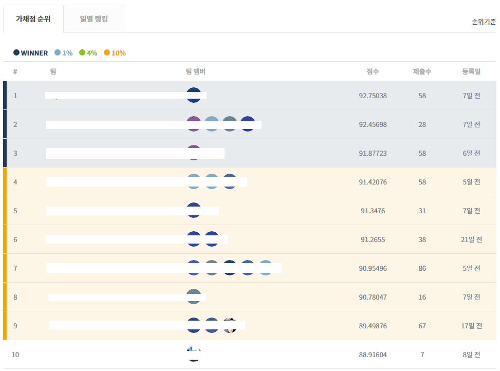
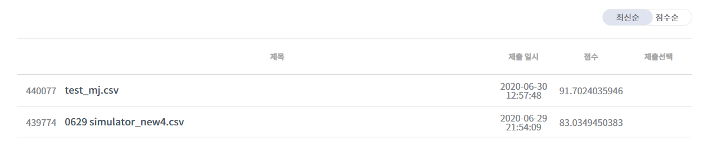

<h1>LEGO Manufacturing Process Optimization AI Competition 
(블럭 장난감 제조 공정 최적화 AI 경진 대회)</h1>

# # Introduction

- **[Subject]**

  **Optimizing Block Toy(LEGO) Manufacturing Process based on AI**

  인공지능 AI 활용 블럭 장난감 제조 공정 최적화

- **[Background]**

  **To increase the efficiency of the manufacturing process by increasing demand for LEGO before 'National Children's Day'.**

  어린이날 전후로 늘어난 블럭 장난감 수요 증가로 제조 공정 효율을 높이려 합니다.

  **Make a new way using AI to create process design algorithms for timely/quantitative production.**

  AI기반의 새로운 접근 방법을 활용하여 적기/적량 생산을 위한 공정 설계 알고리즘을 만들어주세요! 

- **[Mission]**

  **Design optimal block toy production process to meet scheduled demand**

  정해진 수요에 맞춰 최적 블럭 장난감 생산 공정 설계

  **Create a manufacturing plan with AI algorithm and Submit csv file**

  AI 기반 알고리즘으로 공정 계획을 만들어 csv 파일 제출

- **Hosting, LG Science Park. & Supervising, DACON.**

  주최, LG사이언스파크 &  주관, DACON

 

# # Ranking

- **The final ranking : DQ**

  최종 순위 : 실격

  

  

- **My team was disqualified for using multiple accounts.** 

  **We got penalty for violating a rule which says a team have to use only one account for this competition.** 

  이 대회에서 실격 처리 되었습니다. 

  1팀 1계정 사용 규정을 위반하고, 다중 계정을 사용했다는 점에서 페널티를 받았습니다.

- **My team's score is 91.70, which is probably enough to rank 4th.**

  우리 팀의 최종 점수는 91.70를 기록했는데, 이는 4위를 할 수 있는 점수입니다.

  

 

# # After the competition

- **What I learnd from this contest**

  느낀점