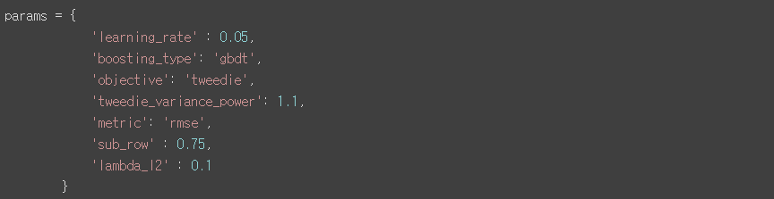
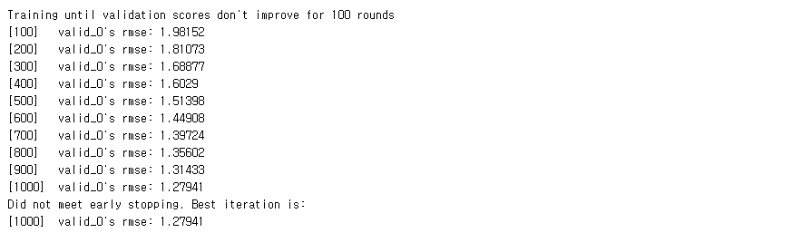
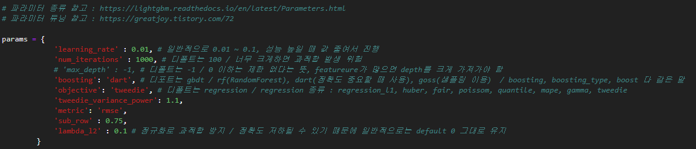
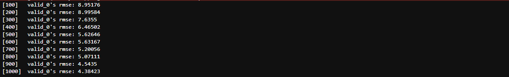
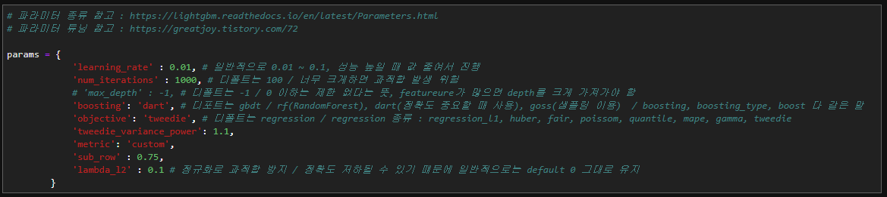
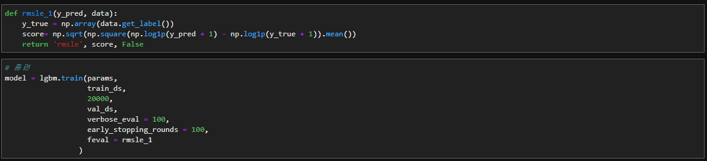
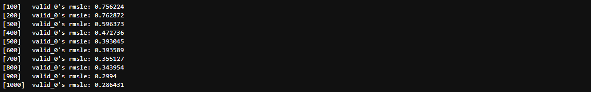

# 12th, July

### 1st

lgbm, basic version

코드 공유에서 lgbm 모델을 사용한 사람의 코드를 기본적으로 사용

rmse가 낮길래 기대했으나, 실제 점수는 별로라 파라미터 튜닝이 필요해 보임

HDLY_0712(1) score = 6.6072841989 

### 2nd

lgbm, parameter tuned

파라미터 값들을 검색한 내용들 위주로 바꿔서 진행해 봄

하지만 rmse 값이 너무 높아서, 아마도 점수가 좋지 않을 듯 하여 제출은 하지 않음

(1일 3회 최대 제출 너무 야박하다)

score = not sumbitted

### 3rd

lgbm, metric : rmse -> custom(with rmsle function)

rmse 대신 rmsle 구하는 함수를 작성해서 적용

학습 횟수도 1,000에서 20,000으로 올리고 진행

HDLY_0712(2) score = 6.9135767409