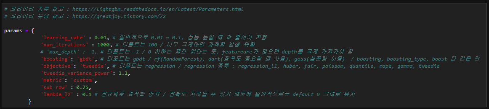
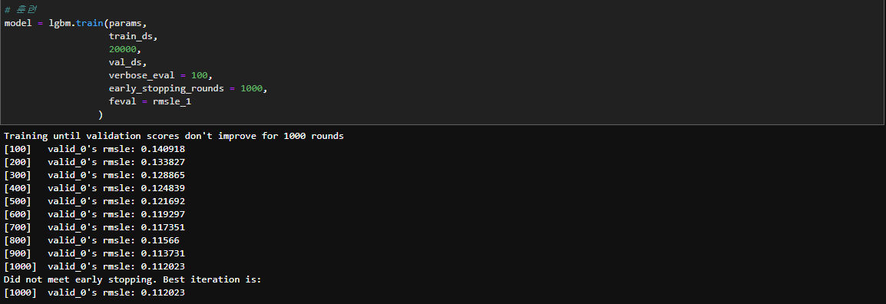
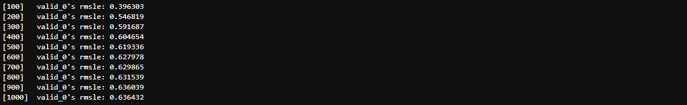
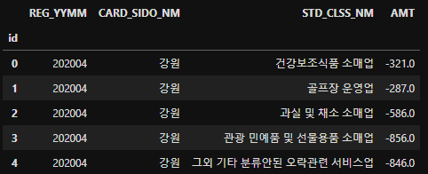
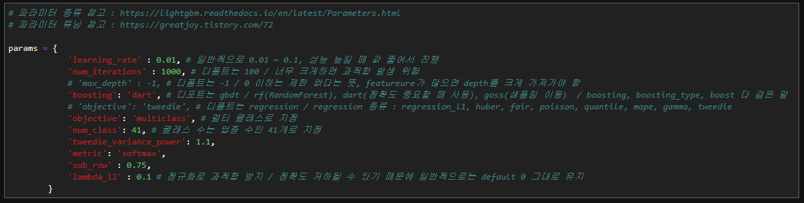
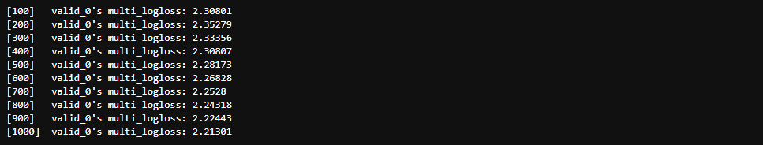
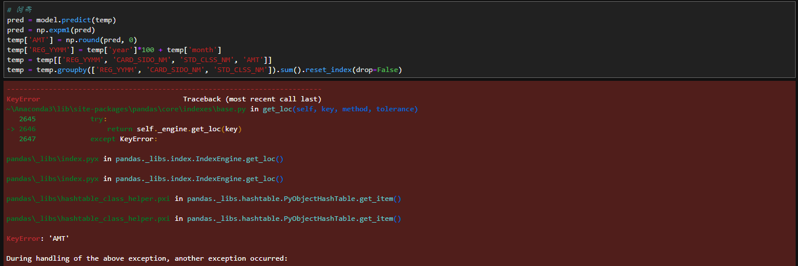
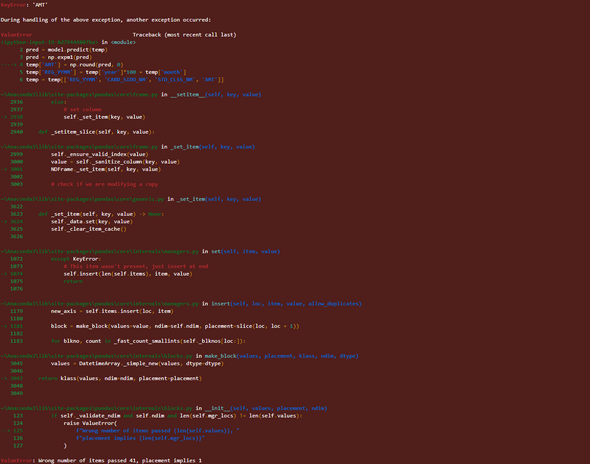
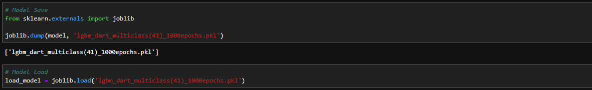

# 13th, July

### 1st

lgbm, metric=custom(rmsle_1 function), boosting=gdbt

부스팅은 기본인 gdbt로 설정하고, metric은 rmsle_1으로 설정했지만

굉장히 점수가 낮음

HDLY_0713 score = 7.2448565177

### 2nd

lgbm, parameter tuned

boosting : dart

objective : li

metric : custom(rmsle_1)

train : 20000, eval=100, earlystopping=1000

score = not sumbitted

### 3rd

lgbm, parameter tuned

boosting : dart

objective : multiclass

metric : softmax

train : 20000, eval=100, earlystopping=100

predict 과정에서 에러 남

클래스 수는 41개로 학습 시켰는데,  AMT 하나만 예측하려고 하니까 에러나는 듯?

일단은.... 모델 저장 시켜두고, 내일 논의하기로

model svae & load 까지 구현

+

추가)

4월 점수를 기준으로 보드에 올라가고, 7월은 나중이지만.

가채점 점수가 낮으면(좋으면) 그냥 그걸 4월 데이터라고 가져가서

시계열로 7월을 판단하면 안되나?

-> 7월 28일에 4월 데이터 공개 예정