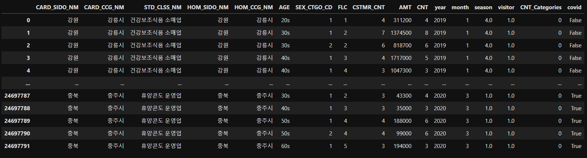
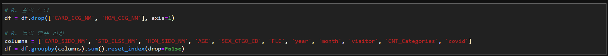
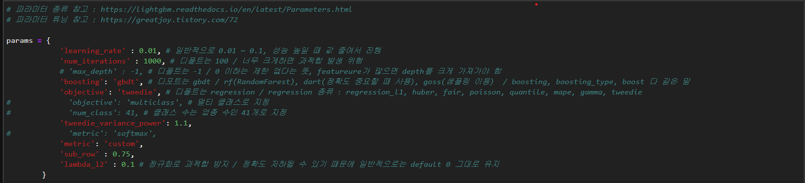
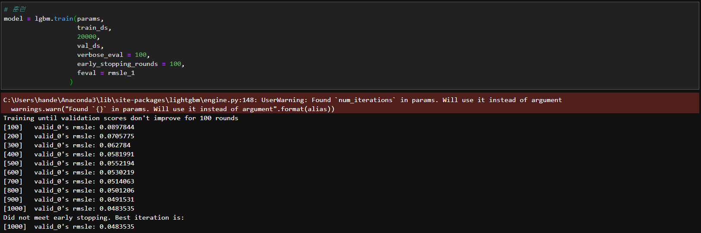
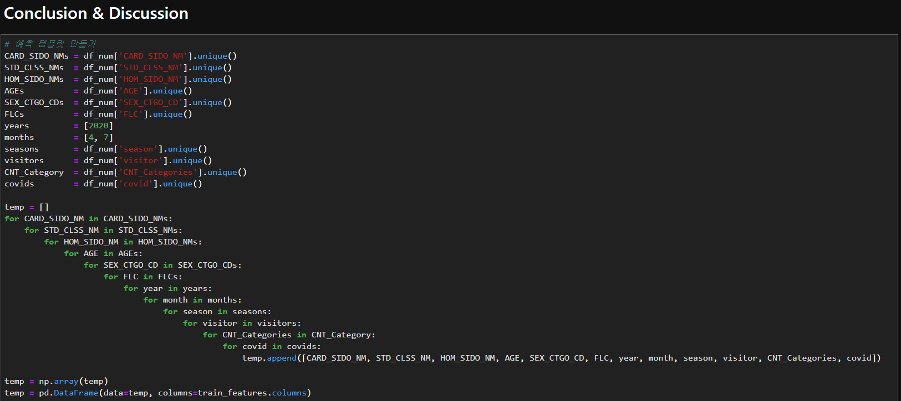

# 15th, July

### 1st

독립 변수들에 대한 전처리 진행

1. 계절 추가 : 봄1 여름2 가을3 겨울4
2. 결제 지역과 거주지 기준으로 여행객0, 거주자1로 구분
3. 결제 건수를 20가지 범위로 나눠서 0~19로 카테고리 화
4. 코로나 영향이 있는 업종들은 따로 표시

위 4가지 컬럼을 추가해서 진행

총 11개 독립변수

모델은 기본 lgbm 으로 진행

boosting : gbdt

objective : tweedie

metric : custom(rmsle_1)

train : 1000 epochs

예측 템플릿 부분 코드 추가

....

temp 만들다가 죽어버림

HDLY_0715 score = 

### 2nd

