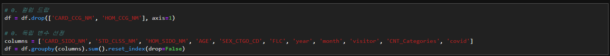
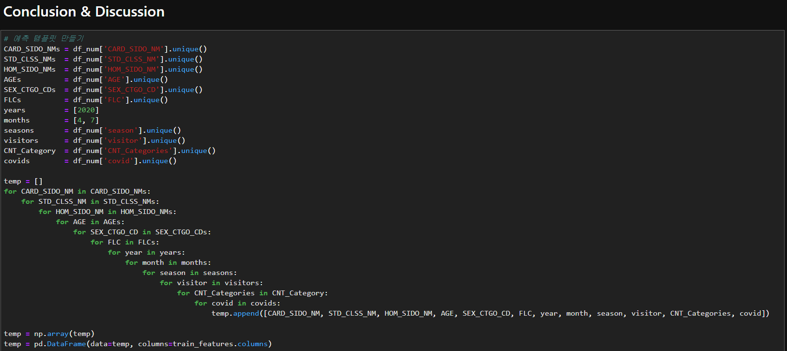

# 17th, July

### 1st

독립 변수들에 대한 전처리 진행

1. 계절 추가 : 봄1 여름2 가을3 겨울4
2. 결제 지역과 거주지 기준으로 여행객0, 거주자1로 구분
3. 결제 건수를 20가지 범위로 나눠서 0~19로 카테고리 화
4. 코로나 영향이 있는 업종들은 따로 표시

위 4가지 컬럼을 추가해서 진행

총 11개 독립변수

모델은 기본 lgbm 으로 진행

boosting : gbdt

objective : tweedie

metric : custom(rmsle_1)

train : 20,000 epochs

예측 템플릿 부분 코드 추가

....

temp 만들다가 죽어버림, 그래서 다른 컴퓨터로 해봄

1) KJH RAM 32G, 메모리 터짐...

2) 친구 연구실 컴퓨터 RAM 16G, 메모리 터짐...

### 2nd

독립 변수들에 대한 전처리 진행

1. 계절 추가 : 봄1 여름2 가을3 겨울4
2. 결제 지역과 거주지 기준으로 여행객0, 거주자1로 구분
3. 결제 건수를 20가지 범위로 나눠서 0~19로 카테고리 화
4. 코로나 영향이 있는 업종들은 따로 표시

위 4가지 컬럼을 추가해서 진행

총 11개 독립변수

모델은 기본 lgbm 으로 진행

boosting : gbdt

objective : tweedie

metric : custom(rmsle_1)

train : 20,000 epochs

예측 템플릿 부분 코드 추가

여기서 12개를 10개로 줄여서 시도해봄(HOM_SIDO_NM, FLC 두개 삭제)

터짐...

### 3rd

main code 변경 : [Main_0717_10fors.ipynb] => [Main_0717_10combinations.ipynb]

일단, 변수를 줄이고 for 반복 횟수를 줄여야 한다고 생각

따라서 KMH님이 그래프를 통해 feature importance를 확인한 것을 이용해서 비중 없는 변수는 삭제하기로 함

모델을 학습시키는 흐름은 이전이랑 거의 동일

- 먼저, 컬럼을 추가 함 : 계절, 거주/여행, 결제 건수, 코로나 ...

- 이렇게 4개를 추가해서, 총 12개의 독립변수로 1차 모델 학습 시킴
- 모델 학습 파라미터 동일, 학습 횟수 20000번으로 동일

- 여기서 feature 비중을 그래프로 그려서 확인해 봄

